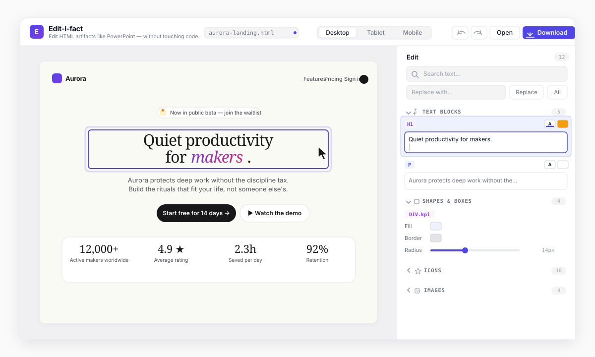
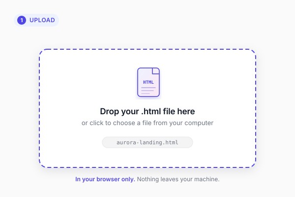
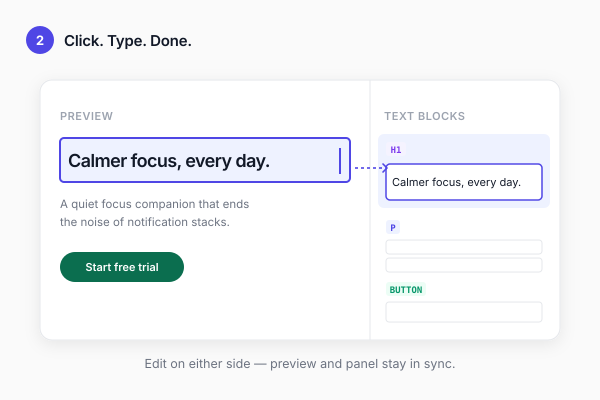
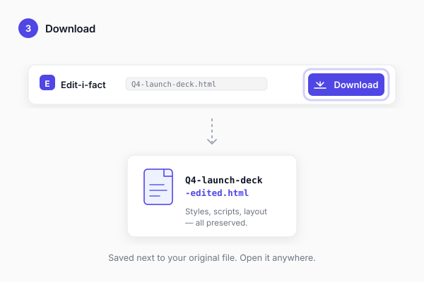

# Edit-i-fact

**Edit HTML artifacts like PowerPoint — without touching code.**

A browser-based visual editor for `.html` files generated by AI tools (Claude artifacts, ChatGPT, Cursor). Upload a slide deck, landing page, or dashboard — then edit text, swap images, recolour shapes, restyle icons, and change borders, all without touching code.

## How it works

| 1. Upload | 2. Edit | 3. Download |
|---|---|---|
|  |  |  |
| Drop an `.html` file. It's read in your browser — nothing leaves your machine. | Click any text, shape, icon, or image. Edits stay in sync across preview and side panel. | Saves as `{name}-edited.html` with every original style, script, and layout preserved. |

## Try the demo

Open `index.html` in your browser, then upload [`test-fixtures/aurora-landing.html`](test-fixtures/aurora-landing.html) — a polished SaaS landing page (hero, stats, 3-tier pricing, 5-star testimonials, a comparison table, and shape cards with borders / backgrounds / radius). It exercises every editor category in one file.

Or drop in any `.html` artifact you've generated with Claude, ChatGPT, or Cursor.

## What you can edit

The side panel groups edits into four categories. Sections are collapsible — click a header to roll it up.

- **Text blocks** — any visible text (headings, paragraphs, buttons, links, list items, captions, table cells). Edit inline in the preview or via the side-panel textarea. Includes a text-color picker and a background-color picker per block.
- **Shapes & boxes** — any container with a visible background, border, or rounded corners (cards, KPI tiles, hero sections). Edit fill, border colour, and corner radius.
- **Icons** — inline `<svg>` icons (stars, checkmarks, feature glyphs). Edit the icon colour — applies to both the SVG root and every descendant path.
- **Images** — `` elements. Swap with any local file (embedded as a data URL), edit alt text.

## Features

- **Two-way editing** — click any element in the preview or use the side panel; both stay in sync.
- **Click-to-navigate** — clicking an element in the preview expands its category in the side panel (if collapsed), scrolls the matching row into view, and pulses it briefly.
- **Search & replace** — across every detected text block, with match counts.
- **Categorised edit panel** — Text blocks · Shapes · Icons · Images, each collapsible, each with a count.
- **Per-block style controls** — text colour, background colour, border colour, border radius, icon colour.
- **Image replacement** — embedded as a data URL so the output stays self-contained.
- **Comparison tables** — `<th>` and `<td>` cells are detected as editable text blocks.
- **Undo / redo** — coalesced keystrokes (⌘Z / ⌘⇧Z), covering text, colours, borders, radius, and image changes.
- **Responsive preview** — Desktop, Tablet, Mobile widths.
- **Autosave** — your draft survives an accidental refresh, stored in `localStorage`.
- **Zero install** — one self-contained `index.html`. No build, no server.

## Keyboard shortcuts

| Action | Shortcut |
|---|---|
| Open file | ⌘ O |
| Download | ⌘ S |
| Undo | ⌘ Z |
| Redo | ⌘ ⇧ Z (or ⌘ Y) |
| Focus search | ⌘ F |
| Commit inline edit | Enter |
| Cancel inline edit | Esc |
| Toggle a section | Click the header (or Enter / Space when focused) |

## How it works under the hood

One self-contained `index.html`. Inside, vanilla JS organised as small modules: `FileIO`, `Detector`, `DocModel`, `PreviewFrame`, `SidePanel`, `History`, `App`.

When you upload a file, it's parsed once with `DOMParser`. Detection runs in two phases:

1. **Parse-time** — each text block, image, and shape/icon candidate is tagged with a stable `data-edit-id`. The parsed `Document` is the single source of truth.
2. **Post-render** — once the iframe has rendered, `DocModel.completeDetection` reads computed styles to confirm which shape candidates actually have a visible background or border (most artifacts style via CSS classes, so inline-style detection alone isn't enough). Candidates that don't qualify have their `data-edit-id` stripped so they don't intercept clicks.

Edits in either surface flow through one of `setText` / `setColor` / `setBgColor` / `setBorderColor` / `setBorderRadius` / `setIconColor` / `setImageSrc` / `setImageAlt`, which mutate the source document and mirror the change to whichever surface didn't originate the edit. The `data-edit-id` attributes are stripped on download, so the output is byte-clean.

## What's not in MVP

Slide-section navigator, multi-file projects, cloud save, real-time collab, link/href editing, font-family swapping, padding/spacing controls. The architecture leaves room for them.
